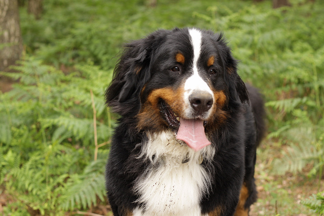
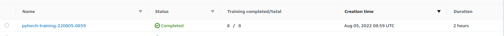
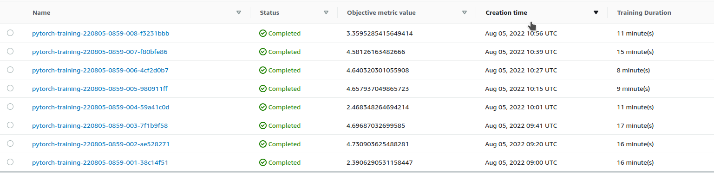
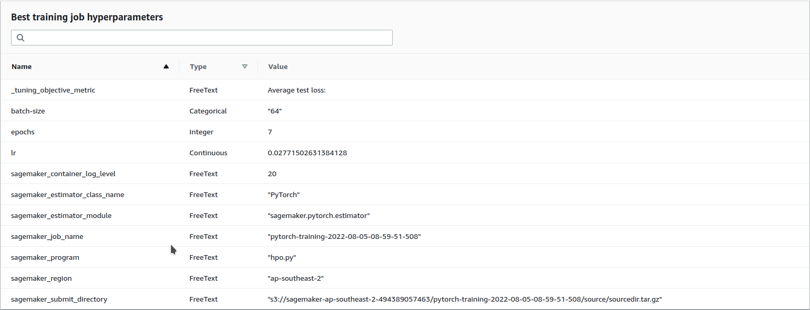
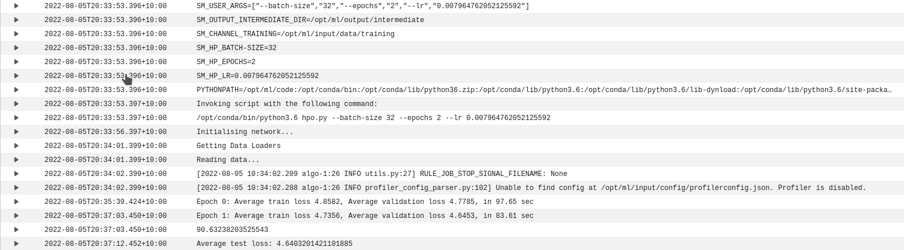
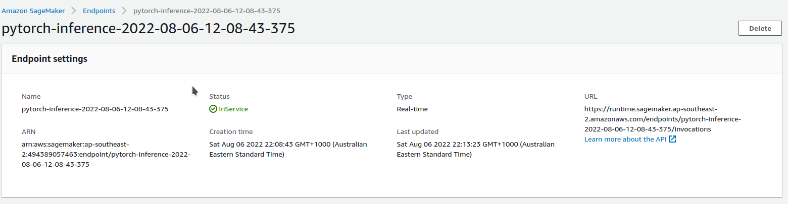

# Dog Breed Classification using AWS SageMaker



This project involves the creation of an image classifier to enable dog breeds to be identified. 

I like dogs but people I find worrisome. Sometimes I want to find out what breed a dog is without having to also find out that he's a good boy who likes walks and chasing cars.

Worry no more, using AWS Sagemaker, we can acquire an almost fetishistic quantity of dog images and, using a pretrained neural network, train a classifier to recognise dog breeds from a simple image without the need for tiresome discussions with the owner about which breeder they bought it from.

Conversations in the street with strangers about their dogs only invites the acquisition of acquintences. Don't take that risk. 

Take a photo and have ML solve the problem for you.

## Project Set Up and Installation

After some repeated frustrations with the Udacity environment being unreliable at times for me (possibly because I live very far away from the AWS servers that are used as a default), I have acquired my own AWS environment hosted in Sydney. I have downloaded the started files for the udacity project. I downloaded the images from the repo and stored them in my own AWS S3 environment. 

## Dataset
The data contains images of dogs broken up into 133 distinct breeds. The data has been additionally broken up into premade training, validation and test datasets.I have chosen to train a classifier which is capable of identifying the dog breed from a dog image. The data is acquired from the udacity dogImages mirror hosted on aws.

### Access
Dataset was uploaded to the default bucket for the sagemaker environment.

## Hyperparameter Tuning
For convenience of training speed and demonstrating this proof of concept (and the fact that I never need to be *that* certain what kind of dog I'm seeing), I elected to use a pretrained model that had relatively few parameters. RESNET18 provides reasonable performance without being overly large and increasing training times and costs.

I have elected the finetune the RESNET18 network with three hyperparameters. These hyperparameters are:

1. learning rate
2. batch size for both training and evaluation
3. The number of training epochs.

Learning rate is a parameter which affects how quickly a neural network's weights are adjusted in response to training inputs. Learning rate needs to be chosen optimally so that the model learns sufficiently quickly without becoming unstable or learning a suboptimal set of weights for the problem. I have elected to train this parameter between 1e-3 and 1e-1. This range provides a good snapshot of likely optimal rnages for this parameter that I have encountered in the past.

Batch size controls the number of training examples a network is allowed to evaluate prior to having its weights adjusted from the output error term. Setting a large batch size can result in speeding up training by reducing the total number of updates to the weights of hte model. However, performing small batch updates to the weights can result in better training performance by allowing the model to learn from specific examples. Overly large batch sizes will tend to average the effect of traiining. I have elected four  values between 32 and 256. These values will provide a reasonable range in which to tune parameters and none is either too small or too large given the size of the training dataset. 

Epochs controls the number of times the training examples are shown to the model to adjust the weights. Increasing the number of epochs can allow the model to have greater exposure to the training dataset and improve the training performance. However, too many epochs can result in the model overfitting to the training data and a decline in test-set performance. The reason I have chosen the intergar range from 2 to 8 is to balance cost against potential performance given the amount of training data and the relatively high cost of increasing the number of epochs above a certain threshold.

What kind of model did you choose for this experiment and why? Give an overview of the types of parameters and their ranges used for the hyperparameter search

Remember that your README should:
- Include a screenshot of completed training jobs
- Logs metrics during the training process
- Tune at least two hyperparameters
- Retrieve the best best hyperparameters from all your training jobs

Referencing the above, although it makes no sense to include in a readme for a project the following images, I include them here to satisfy the marking rubric:

Completed hyperparameter training job:



Individual training jobs associated with that process.



The parameters from the hpo training job that the system deemed optimal



I also include the following screenshot from the cloudwatch logs:



## Debugging and Profiling

In order to finetune the model, I have set a number of sagemaker rule configs and two profiling rules.

The debugger rules I have set are:

1. Vanishing Gradients
   - Monitoring the gradients of the loss function to determine if weights are not adjusting because the gradients are too small
2. Overfitting
   - Overfitting occurs when the model learns the specific features of training data and is unable to generalise
3. Overtraining
   - Related to Overfitting. 
4. Poor weight initialisation
   - If weights fall out of an optimal range when randomly initialised upon startup, the model will struggle to learn the required features.
5. Loss Not Decreasing
   - Monitors if the model's loss function is not decreasing over training to alert the user that the model is no longer learning.
   
The profiler configs I have set include:

1. Low GPU Utilisation
2. A profiler report config to enable a report to be generated. 

The outputs from this report can be used to determine if changes need to made to the model prior to deployment


### Results
The model appears to have a decreasing loss function across the training cycle for both the training and test parameters. 

The results of the profiling report appear to indicate that the usage of the instance is appropriate - albeit it might be possible to use a less powerful GPU as the current model is not heavily using the current instance. However, the instance type I have selected is among one of the smallest possible that is still configured with a GPU.

## Model Deployment

In order to deploy the model, I configured a script called deployment.py. This script contains three functions which are required by the Pytorch deployment:

1. model_fn
  - this function returns the model
2. input_fn
  - this function processes input to the end point. In here I have implemented the required transform so that all that needs to be done by the user is to open the image and send that as a payload to the end point.
3. predict_fn
  - this function takes the image passed by the input_fn and applies the same transform as the hpo.py and train_model.py scripts. This transform is based upon the pytorch resnet18 documentation and the model is asked to make a prediction.


The following is the code I used in [sagemaker](train_and_deploy.ipynb) to call the endpoint.

```python
from sagemaker.serializers import IdentitySerializer
import numpy as np

import sagemaker 

sagemaker_session = sagemaker.Session()

predictor.serializer = IdentitySerializer("image/jpeg")
with open("img/Bernese_mountain_dog_01651.jpg", "rb") as f:
    payload = f.read()

inference = predictor.predict(payload)


file_list = sagemaker_session.list_s3_files(bucket=bucket, key_prefix='dog-breed-data/test')
class_list = np.unique([file.split('/')[2] for file in file_list])

class_list[inference.argmax()]

```

The functioning endpoint looks like this. 


## Standout Suggestions
Absolutely not.

